# OpenClaw 系统架构文档

## 概述

OpenClaw 是一个基于 TypeScript 构建的 AI 代理网关系统，提供多渠道消息处理、插件扩展、任务调度等核心功能。系统采用模块化设计，支持灵活的配置和扩展。

## 目录结构

```
openclaw/
├── src/                    # 源代码目录
│   ├── agents/            # AI 代理模块
│   ├── auto-reply/        # 自动回复系统
│   ├── browser/           # 浏览器集成
│   ├── channels/          # 消息渠道（Telegram, Discord, Slack 等）
│   ├── cli/               # 命令行接口
│   ├── config/            # 配置系统
│   ├── cron/              # 定时任务系统
│   ├── gateway/           # 网关服务器
│   ├── hooks/             # 钩子系统
│   ├── infra/             # 基础设施组件
│   ├── memory/            # 内存/存储管理
│   ├── plugins/           # 插件系统
│   ├── security/          # 安全模块
│   ├── terminal/          # 终端 UI
│   ├── tts/               # 文本转语音
│   ├── tui/               # 终端用户界面
│   ├── utils/             # 工具函数
│   ├── wizard/            # 安装向导
│   └── index.ts           # 主入口
├── extensions/            # 插件扩展目录
├── docs/                  # 文档目录
└── test/                  # 测试文件
```

## 核心架构

### 1. 入口与启动流程

**文件**: `src/index.ts`

系统支持两种运行模式：

1. **CLI 模式**: 作为命令行工具运行
2. **库模式**: 作为库被其他模块导入

```typescript
// CLI 模式入口
if (isMain) {
  installUnhandledRejectionHandler();
  void runLegacyCliEntry(process.argv);
}

// 库模式导出
export let loadConfig: LibraryExports["loadConfig"];
export let loadSessionStore: LibraryExports["loadSessionStore"];
// ... 更多导出
```

**启动流程**:
1. 安装全局错误处理器
2. 加载 CLI 依赖
3. 初始化配置系统
4. 启动网关服务器或执行命令

### 2. 配置系统

**核心文件**: `src/config/`

#### 2.1 配置加载

配置系统采用分层设计：

```
src/config/
├── config.ts           # 配置入口
├── io.ts               # 配置 I/O 操作
├── validation.ts       # 配置验证
├── types.ts            # 类型定义
├── zod-schema.ts       # Zod 验证模式
├── defaults.ts         # 默认值
└── sessions/           # 会话配置
    ├── store.ts        # 会话存储
    └── store-maintenance.ts  # 会话维护
```

#### 2.2 配置验证流程

```typescript
// 配置验证管道
validateConfigObjectWithPlugins(raw)
  → validateConfigObjectRaw(raw)      // 基础验证
  → validateIdentityAvatar(config)    // 头像验证
  → validateGatewayTailscaleBind()    // 网关绑定验证
  → loadPluginManifestRegistry()      // 插件清单加载
  → validatePluginConfigs()           // 插件配置验证
```

#### 2.3 配置类型层次

```typescript
type OpenClawConfig = {
  meta?: ConfigMeta;
  agents?: AgentsConfig;
  models?: ModelsConfig;
  gateway?: GatewayConfig;
  plugins?: PluginsConfig;
  channels?: ChannelsConfig;
  memory?: MemoryConfig;
  mcp?: McpConfig;
  // ... 更多配置
};
```

### 3. 插件系统

**核心文件**: `src/plugins/`

#### 3.1 插件架构

```
src/plugins/
├── types.ts            # 插件类型定义
├── registry.ts         # 插件注册表
├── loader.ts           # 插件加载器
├── runtime/            # 插件运行时
├── manifest-registry.ts # 清单注册
└── config-state.ts     # 配置状态管理
```

#### 3.2 插件类型定义

```typescript
type OpenClawPluginDefinition = {
  id?: string;
  name?: string;
  description?: string;
  version?: string;
  kind?: PluginKind;
  configSchema?: OpenClawPluginConfigSchema;
  register?: (api: OpenClawPluginApi) => void | Promise<void>;
  activate?: (api: OpenClawPluginApi) => void | Promise<void>;
};
```

#### 3.3 插件 API

插件注册时接收的 API 对象：

```typescript
type OpenClawPluginApi = {
  id: string;
  name: string;
  version?: string;
  description?: string;
  source: string;
  
  // 工具注册
  tool: (tool: AnyAgentTool) => void;
  
  // 渠道注册
  channel: (channel: ChannelPlugin) => void;
  
  // 提供者注册
  provider: (provider: ProviderConfig) => void;
  
  // 钩子注册
  on: <K extends PluginHookName>(
    hookName: K,
    handler: PluginHookHandlerMap[K],
    opts?: { priority?: number }
  ) => void;
  
  // 配置访问
  getConfig: <T = Record<string, unknown>>() => T;
  
  // 日志
  log: PluginLogger;
};
```

#### 3.4 插件加载流程

```
loadPluginManifestRegistry()
  → 扫描插件目录
  → 解析 openclaw.plugin.json
  → 验证配置模式
  → 注册到 PluginRegistry
  → 调用 register() 函数
  → 调用 activate() 函数
```

### 4. 任务调度系统

**核心文件**: `src/cron/`

#### 4.1 任务类型

```typescript
type CronJob = {
  id: string;
  name: string;
  schedule: CronSchedule;
  payload: CronPayload;
  delivery?: CronDelivery;
  state: CronJobState;
  priority?: number;  // 优先级 (0-100)
};

type CronSchedule =
  | { kind: "at"; at: string }
  | { kind: "every"; everyMs: number; anchorMs?: number }
  | { kind: "cron"; expr: string; tz?: string; staggerMs?: number };
```

#### 4.2 任务执行流程

```
onTimer(state)
  → collectRunnableJobs()     // 收集可运行任务
    → 按优先级排序
    → 按时间排序
  → executeJobCoreWithTimeout() // 执行任务
  → 错误隔离处理
  → 更新任务状态
```

#### 4.3 任务优先级机制

```typescript
// 任务按优先级排序
jobs.sort((a, b) => {
  const priorityA = a.priority ?? 50;
  const priorityB = b.priority ?? 50;
  if (priorityA !== priorityB) {
    return priorityB - priorityA;  // 高优先级优先
  }
  return (a.state.nextRunAtMs ?? 0) - (b.state.nextRunAtMs ?? 0);
});
```

#### 4.4 错误隔离

每个任务在独立的 try-catch 块中执行，确保单个任务失败不影响其他任务：

```typescript
try {
  const result = await executeJobCoreWithTimeout(state, job);
  return { jobId: id, ...result };
} catch (err) {
  // 记录错误详情
  job.state.lastError = errorText;
  job.state.lastErrorReason = resolveFailoverReasonFromError(errorText);
  return { jobId: id, status: "error", error: errorText };
} finally {
  // 清理任务状态
  job.state.runningAtMs = undefined;
}
```

### 5. 会话管理系统

**核心文件**: `src/config/sessions/`

#### 5.1 会话存储

```typescript
type SessionEntry = {
  sessionId?: string;
  channel?: string;
  lastChannel?: string;
  lastTo?: string;
  lastAccountId?: string;
  updatedAt?: number;
  acp?: unknown;  // Agent Context Protocol
  deliveryContext?: DeliveryContext;
};
```

#### 5.2 会话维护机制

```
saveSessionStore()
  → pruneStaleEntries()      // 清理过期会话
  → capEntryCount()          // 限制会话数量
  → compressSessions()       // 压缩不活跃会话
  → enforceSessionDiskBudget() // 磁盘预算管理
```

#### 5.3 智能会话压缩

```typescript
function compressSessions(store: Record<string, SessionEntry>): number {
  for (const [key, entry] of Object.entries(store)) {
    const isActive = entry.updatedAt && now - entry.updatedAt < 7 * 24 * 60 * 60 * 1000;
    const isImportant = entry.lastChannel && entry.lastTo;
    
    if (!isActive && !isImportant) {
      compressSessionEntry(entry);  // 压缩会话数据
    }
  }
}
```

### 6. 网关服务器

**核心文件**: `src/gateway/`

#### 6.1 网关架构

```
src/gateway/
├── server.impl.ts      # 服务器实现
├── server-methods/     # 服务器方法
├── session-archive.fs.ts # 会话归档
└── close-reason.ts     # 关闭原因处理
```

#### 6.2 服务器启动

```typescript
export async function startGatewayServer(options: GatewayServerOptions) {
  // 初始化配置
  // 设置路由
  // 启动 HTTP 服务器
  // 初始化插件系统
  // 启动定时任务调度器
}
```

### 7. 消息渠道系统

**核心文件**: `src/channels/`

#### 7.1 支持的渠道

- Telegram
- Discord
- Slack
- Signal
- iMessage
- WhatsApp Web
- MS Teams (插件)
- Matrix (插件)
- Zalo (插件)

#### 7.2 渠道插件接口

```typescript
type ChannelPlugin = {
  id: ChannelId;
  setup?: (api: OpenClawPluginApi) => Promise<void>;
  // 渠道特定方法
};
```

### 8. 安全系统

**核心文件**: `src/security/`

#### 8.1 加密存储

```typescript
// AES-256-GCM 加密
export function encrypt(text: string): string {
  const key = getEncryptionKey();
  const iv = crypto.randomBytes(16);
  const cipher = crypto.createCipheriv('aes-256-gcm', key, iv);
  // ... 加密逻辑
  return `${iv.toString('base64')}:${tag.toString('base64')}:${encrypted}`;
}

export function decrypt(encryptedText: string): string {
  // ... 解密逻辑
}
```

#### 8.2 敏感字段加密

在 `src/agents/auth-profiles/store.ts` 中：

```typescript
// 保存时加密
let encryptedCredential = { ...credential };
if (credential.type === "api_key") {
  encryptedCredential = encryptSensitiveFields(encryptedCredential, ["key"]);
}

// 加载时解密
let decryptedCredential = { ...credential };
if (credential.type === "api_key") {
  decryptedCredential = decryptSensitiveFields(decryptedCredential, ["key"]);
}
```

### 9. 钩子系统

**核心文件**: `src/hooks/`

#### 9.1 钩子类型

```typescript
type PluginHookName =
  | "before_model_resolve"
  | "before_prompt_build"
  | "after_agent_turn"
  | "on_message"
  | "on_tool_call"
  // ... 更多钩子
```

#### 9.2 钩子注册

```typescript
api.on("before_model_resolve", async (context) => {
  // 钩子处理逻辑
  return { model: "gpt-4" };
});
```

### 10. 状态持久化

**核心文件**: `src/cron/store.ts`

#### 10.1 备份机制

```typescript
async function saveCronStore(store: CronStore, storePath: string) {
  // 创建时间戳备份
  const timestamp = Date.now();
  const backupPath = `${storePath}.bak.${timestamp}`;
  await fs.promises.copyFile(storePath, backupPath);
  
  // 清理旧备份（保留最近 5 个）
  await cleanupOldBackups(storePath);
  
  // 保存新文件
  await renameWithRetry(tmp, storePath);
}
```

## 系统架构图

### 整体架构图

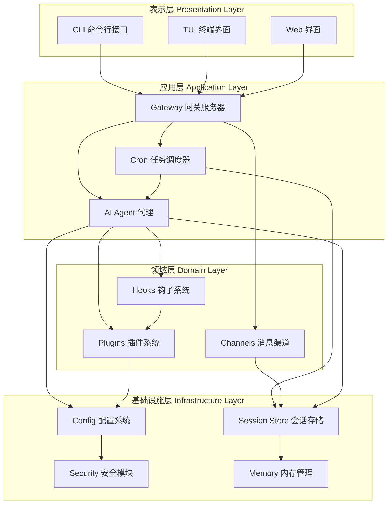

### 核心模块交互图

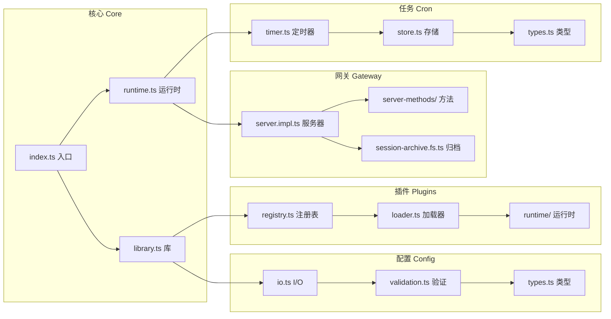

## 数据流

### 消息处理流程

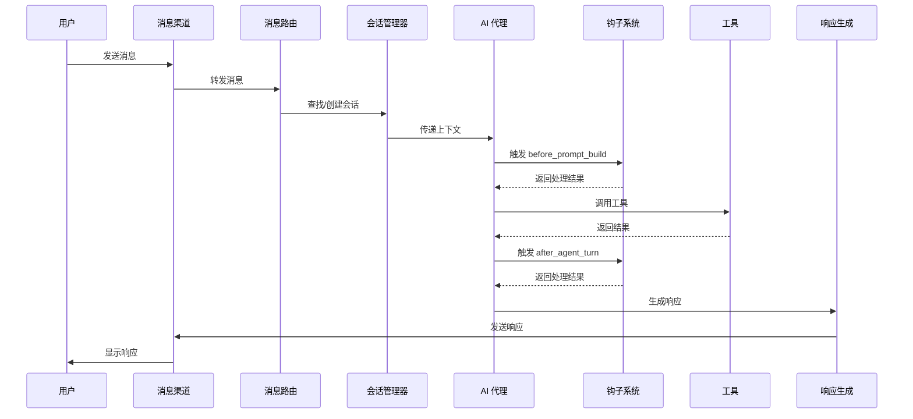

### 配置加载流程

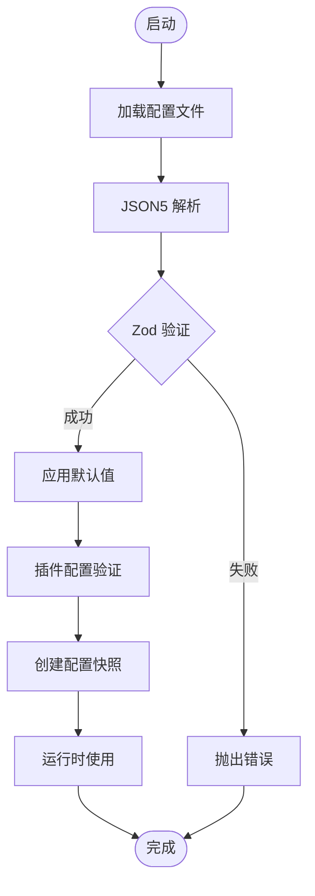

### 插件加载流程

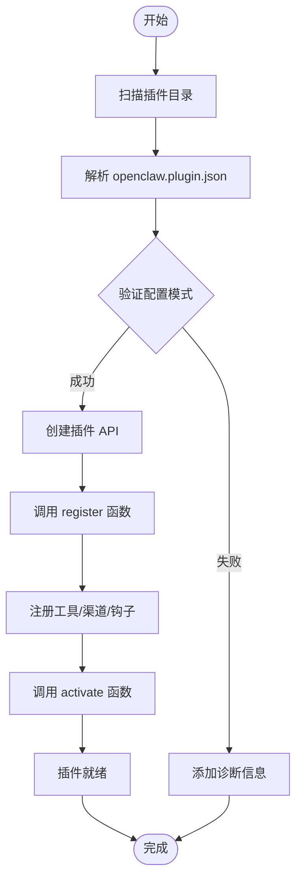

### 任务执行流程

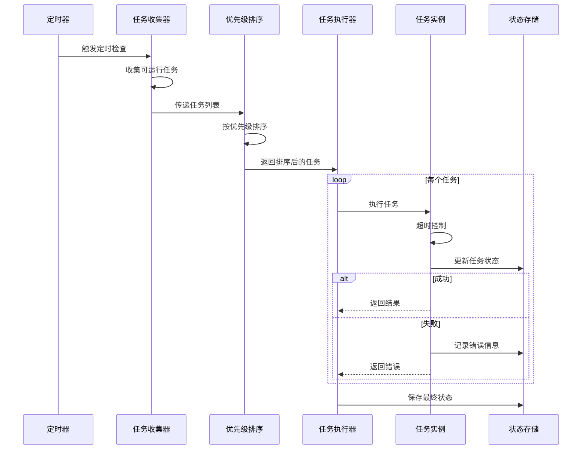

### 会话维护流程

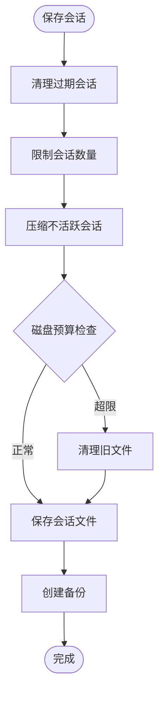

## 模块依赖关系图

### 配置系统依赖图

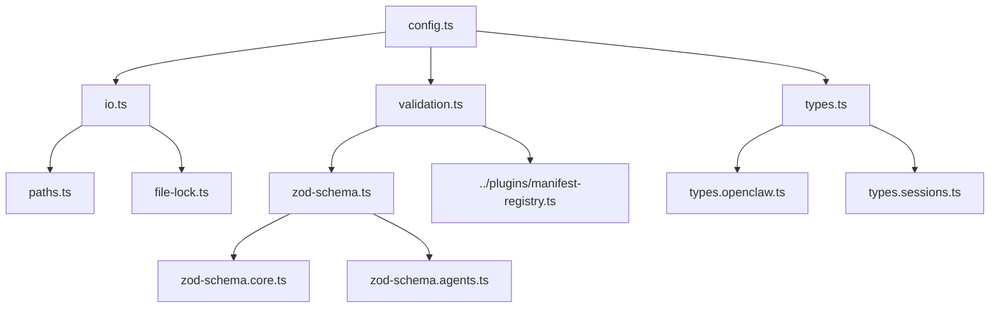

### 插件系统依赖图

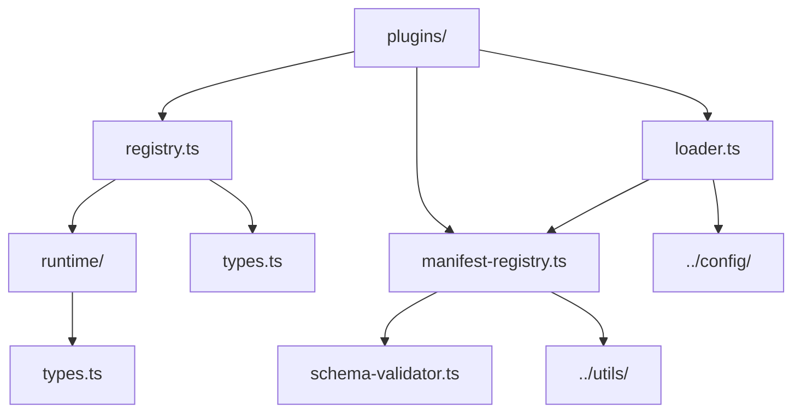

### 任务系统依赖图

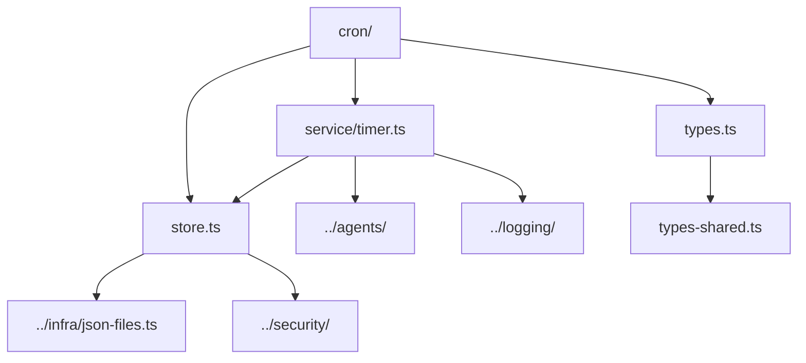

## 状态机图

### 任务状态机

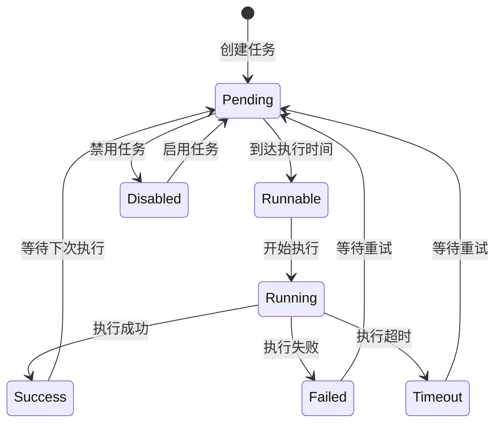

### 会话状态机

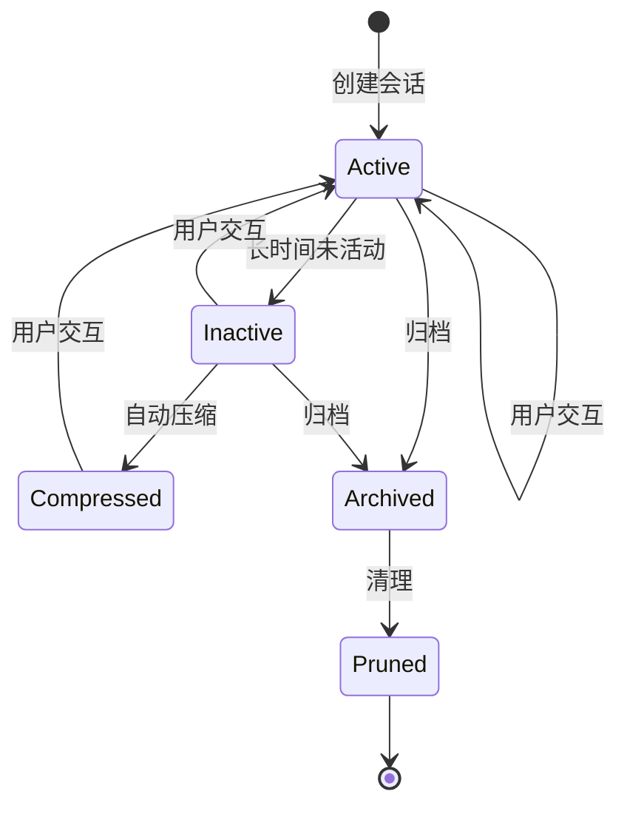

### 插件状态机

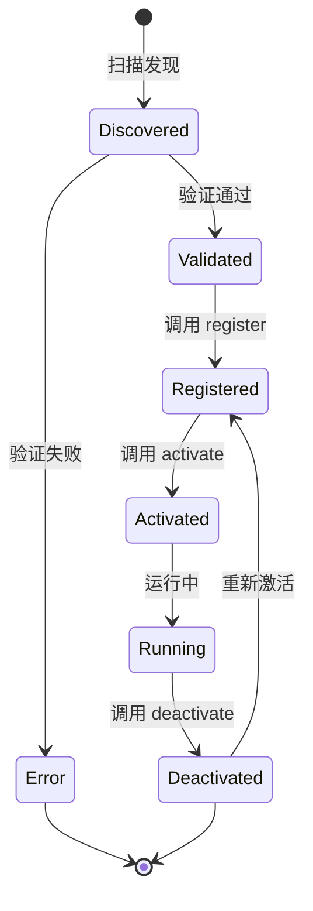

## 部署架构图

### 单机部署架构

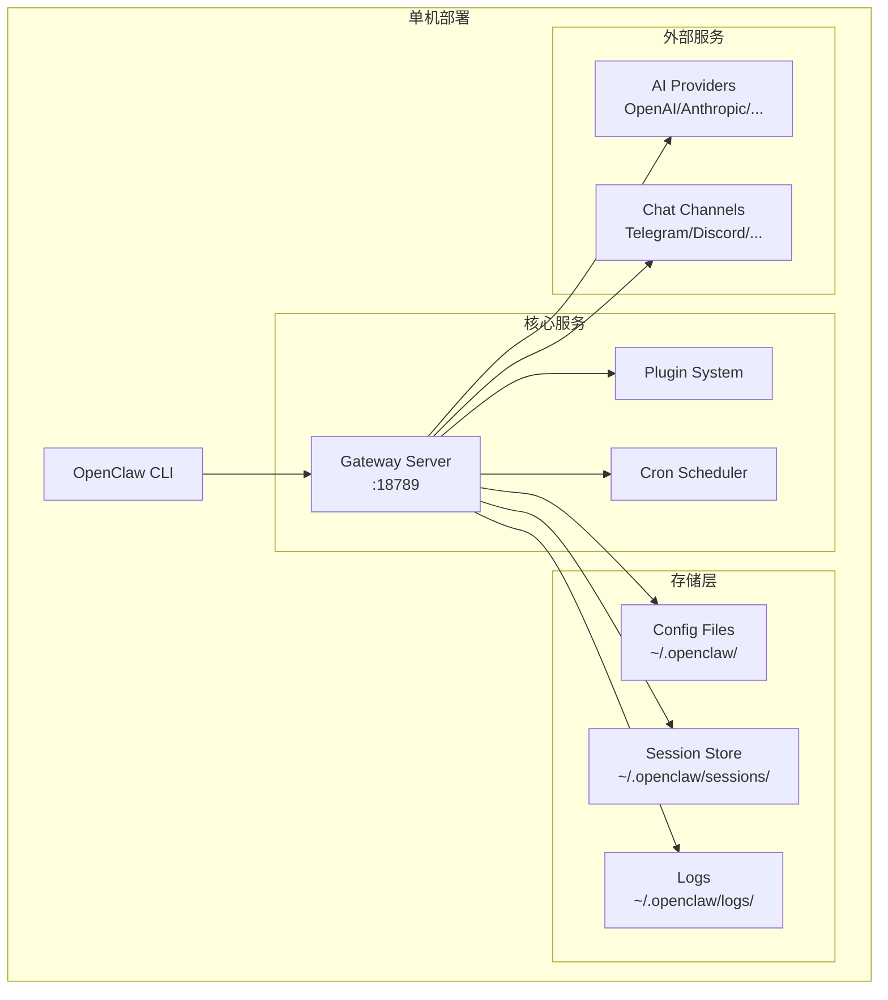

### 分布式部署架构

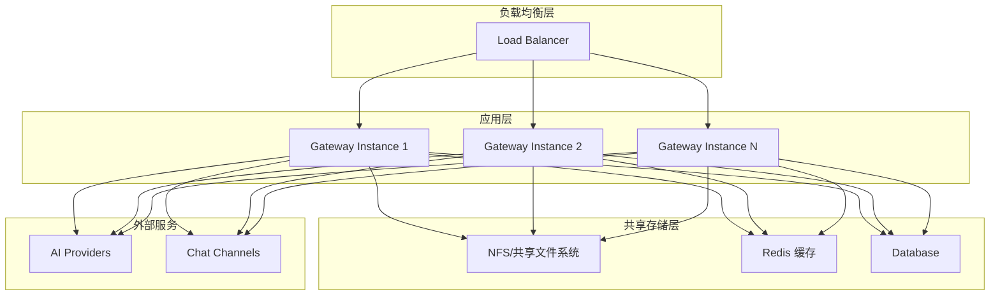

## 关键设计模式

### 1. 依赖注入

系统广泛使用依赖注入模式：

```typescript
type CronServiceDeps = {
  nowMs: () => number;
  log: Logger;
  loadStore: () => Promise<CronStore>;
  saveStore: (store: CronStore) => Promise<void>;
  // ... 更多依赖
};
```

### 2. 插件架构

采用微内核 + 插件架构：
- 核心系统提供基础功能
- 插件通过 API 扩展功能
- 支持热插拔和动态加载

### 3. 事件驱动

钩子系统实现事件驱动模式：
- 定义事件点（钩子）
- 插件注册事件处理器
- 系统在关键点触发事件

### 4. 分层架构

```
表示层 (CLI/TUI)
  ↓
应用层 (Gateway/Agents)
  ↓
领域层 (Channels/Plugins)
  ↓
基础设施层 (Config/Storage/Security)
```

## 性能优化

### 1. 任务优先级队列

- 高优先级任务优先执行
- 避免重要任务被延迟

### 2. 会话压缩

- 自动压缩不活跃会话
- 减少内存和存储占用

### 3. 错误隔离

- 单个任务失败不影响系统
- 提高系统稳定性

### 4. 状态持久化

- 时间戳备份机制
- 快速恢复能力

## 安全机制

### 1. 敏感数据加密

- AES-256-GCM 加密
- 自动加密/解密

### 2. 配置验证

- Zod 模式验证
- 插件配置验证

### 3. 文件权限

- 敏感文件权限控制 (0o600)
- 安全文件写入

## 扩展点

### 1. 添加新渠道

1. 创建渠道插件
2. 实现 ChannelPlugin 接口
3. 注册到插件系统

### 2. 添加新工具

1. 定义工具 schema
2. 实现工具处理函数
3. 通过 API 注册

### 3. 添加新钩子

1. 定义钩子类型
2. 在关键点触发钩子
3. 插件注册处理器

## 测试策略

- 单元测试：`*.test.ts`
- 集成测试：`*.integration.test.ts`
- E2E 测试：`*.e2e.test.ts`
- 测试工具：Vitest

## 部署架构

### 单机部署

```
OpenClaw CLI
  ├── Gateway Server (HTTP)
  ├── Plugin System
  ├── Cron Scheduler
  └── Session Store
```

### 分布式部署

```
Load Balancer
  ├── Gateway Instance 1
  ├── Gateway Instance 2
  └── Gateway Instance N
        ↓
  Shared Storage (Sessions/Config)
```

## 配置示例

### 基础配置

```json
{
  "meta": {
    "lastTouchedVersion": "2026.3.23"
  },
  "agents": {
    "defaults": {
      "model": "gpt-4",
      "thinking": "medium"
    }
  },
  "gateway": {
    "bind": "loopback",
    "port": 18789
  },
  "plugins": {
    "allow": ["plugin-id-1", "plugin-id-2"]
  }
}
```

### 定时任务配置

```json
{
  "id": "daily-report",
  "name": "Daily Report",
  "schedule": { "kind": "cron", "expr": "0 9 * * *" },
  "payload": {
    "kind": "agentTurn",
    "message": "Generate daily report"
  },
  "priority": 80
}
```

## 最佳实践

### 1. 配置管理

- 使用配置验证确保正确性
- 定期备份配置文件
- 使用环境变量覆盖敏感配置

### 2. 插件开发

- 遵循插件 API 规范
- 提供清晰的配置 schema
- 实现优雅的错误处理

### 3. 任务调度

- 合理设置任务优先级
- 实现幂等性操作
- 处理超时和错误

### 4. 安全实践

- 加密敏感数据
- 验证所有输入
- 使用最小权限原则

## 故障排查

### 常见问题

1. **配置验证失败**
   - 检查 JSON 语法
   - 验证必填字段
   - 检查插件配置

2. **插件加载失败**
   - 检查插件路径
   - 验证依赖关系
   - 查看错误日志

3. **任务执行失败**
   - 检查任务配置
   - 查看错误详情
   - 验证权限设置

### 日志位置

- 系统日志：`~/.openclaw/logs/`
- 会话日志：`~/.openclaw/sessions/`
- 网关日志：标准输出/错误

## 版本兼容性

- Node.js: 22+
- TypeScript: ESM
- 支持平台：macOS, Linux, Windows

## 参考资源

- [配置文档](/configuration)
- [插件开发指南](/plugins/development)
- [API 参考](/api/reference)
- [部署指南](/deployment)

---

*最后更新: 2026-03-31*
*版本: 2026.3.23*
