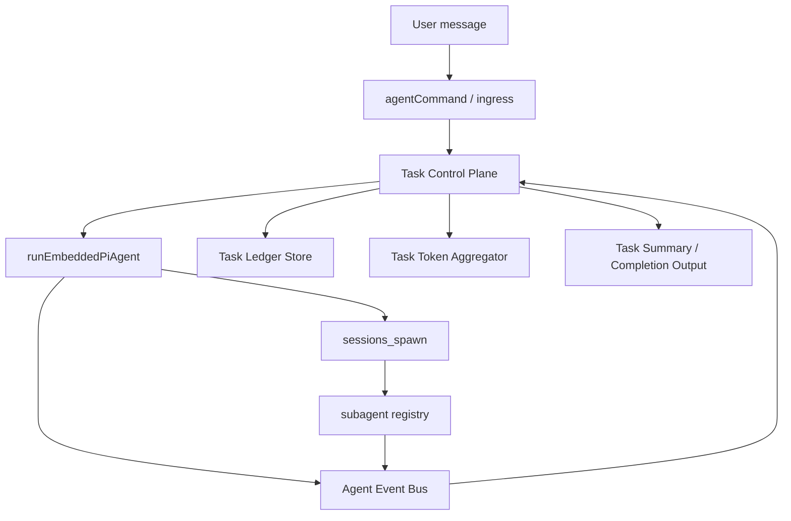
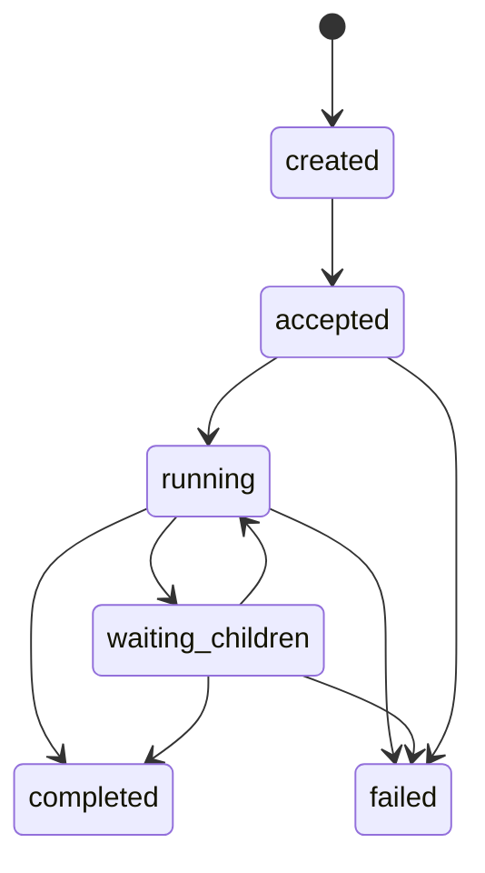

## Goal

Phase 1 must deliver a **minimal, production-oriented control plane** on top of the existing OpenClaw runtime.

This phase does **not** attempt to build the full long-term architecture in one step. It must instead create a small but extensible control layer that:

- introduces a **task ledger** above current agent runs
- keeps **Daemon Agent** as the only user-facing speaker
- reuses the existing **agent loop**, **session serialization**, **sub-agent spawning**, **announce chain**, and **wait semantics**
- creates a stable base for later phases such as block queue, memory layers, and verification loops

The target outcome is:

- top-level user requests can be represented as **tasks**
- child work spawned during a task can be attached to the same task lineage
- task state can be inspected, summarized, and surfaced consistently
- task-level token usage can be recorded and optionally shown at completion
- the implementation is additive and low-risk to current runtime behavior

---

## Scope of Phase 1

### In scope

- Add a **minimal task model** and persistence layer
- Add **task lifecycle state transitions** for top-level and child work
- Attach current runs and spawned subagents to a root `taskId`
- Add **task-level token accounting**
- Add **task progress snapshots** based on existing lifecycle events
- Add **developer-facing and future-user-facing inspection hooks**
- Add tests and clear acceptance criteria
- Add a living checklist file that must be updated during implementation

### Out of scope

- Full blocked-user-decision queue
- Full memory system
- Full process-style parent/child kill tree beyond current subagent registry behavior
- Full process verifier / result verifier framework
- Policy engine / IAM-like permission layer
- Full context tagging and retrieval system
- Cross-session semantic memory
- New channel protocol

---

## Design principles

### 1. Build on existing runtime instead of replacing it

Phase 1 must reuse existing primitives:

- top-level execution path via [agent-command.ts](h:\Claw\WinfyliuOpenclaw\openclaw\src\agents\agent-command.ts)
- embedded execution path via [run.ts](h:\Claw\WinfyliuOpenclaw\openclaw\src\agents\pi-embedded-runner\run.ts)
- lifecycle event bus via [agent-events.ts](h:\Claw\WinfyliuOpenclaw\openclaw\src\infra\agent-events.ts)
- wait semantics via [agent-job.ts](h:\Claw\WinfyliuOpenclaw\openclaw\src\gateway\server-methods\agent-job.ts)
- session serialization via [session-actor-queue.ts](h:\Claw\WinfyliuOpenclaw\openclaw\src\acp\control-plane\session-actor-queue.ts)
- subagent spawn and registration via [subagent-spawn.ts](h:\Claw\WinfyliuOpenclaw\openclaw\src\agents\subagent-spawn.ts) and [subagent-registry.ts](h:\Claw\WinfyliuOpenclaw\openclaw\src\agents\subagent-registry.ts)
- spawn tool entry via [sessions-spawn-tool.ts](h:\Claw\WinfyliuOpenclaw\openclaw\src\agents\tools\sessions-spawn-tool.ts)
- parent/child lineage metadata via [spawned-context.ts](h:\Claw\WinfyliuOpenclaw\openclaw\src\agents\spawned-context.ts)

### 2. Add a control plane, not a second runtime

Do **not** create a parallel execution engine.

Phase 1 should introduce:

- task identity
- task lineage
- task accounting
- task summarization
- task observability

The real execution still happens in the existing agent loop and current `sessions_spawn` behavior.

### 3. Preserve existing UX and compatibility

Current user-visible behavior must continue working:

- normal agent replies still work
- subagent spawning still works
- announce still works
- current tests should not be semantically invalidated

### 4. Make future phases easier

Every Phase 1 type and API should leave room for:

- blocked tasks
- user decision requests
- richer verification
- memory layers
- task recovery

---

## Phase 1 target architecture



### Key idea

Phase 1 inserts a **Task Control Plane** between request intake and runtime observation.

The control plane does not execute the model itself. It:

- creates a root task for a top-level request
- records which run belongs to which task
- ensures child spawns inherit the root task identity
- listens to lifecycle signals and updates task state
- aggregates token usage per task
- produces a consistent completion summary

---

## Proposed new modules

Create these new files under [src/agents](h:\Claw\WinfyliuOpenclaw\openclaw\src\agents):

### 1. [task-events.ts](h:\Claw\WinfyliuOpenclaw\openclaw\src\agents\task-events.ts)

Defines task states, task event types, and transition helpers.

Recommended contents:

- `TaskStatus`
- `TaskNodeStatus`
- `TaskKind`
- `TaskProgressSnapshot`
- `TaskTokenUsage`
- state transition guard helpers

### 2. [task-ledger.ts](h:\Claw\WinfyliuOpenclaw\openclaw\src\agents\task-ledger.ts)

Primary persistence and query layer for tasks.

Responsibilities:

- create task records
- attach top-level run ids
- attach child run ids and child session keys
- update task state from lifecycle signals
- aggregate token usage
- generate task completion view
- expose inspection helpers for future UI/commands

### 3. [task-ledger.types.ts](h:\Claw\WinfyliuOpenclaw\openclaw\src\agents\task-ledger.types.ts)

Holds stable interfaces and record shapes, so implementation can evolve without circular imports.

### 4. [task-ledger.store.ts](h:\Claw\WinfyliuOpenclaw\openclaw\src\agents\task-ledger.store.ts)

Store/load/persist logic.

Recommended initial persistence model:

- JSON file on disk, mirroring the style of lightweight registries
- in-memory map + persisted snapshot

This should remain intentionally simple in Phase 1.

### 5. [task-token-accounting.ts](h:\Claw\WinfyliuOpenclaw\openclaw\src\agents\task-token-accounting.ts)

Logic for task-level token rollups.

### 6. [task-runtime-context.ts](h:\Claw\WinfyliuOpenclaw\openclaw\src\agents\task-runtime-context.ts)

Helpers for threading `taskId`, `rootTaskId`, and `parentTaskNodeId` through existing runtime and tool contexts.

### 7. [task-lifecycle-bridge.ts](h:\Claw\WinfyliuOpenclaw\openclaw\src\agents\task-lifecycle-bridge.ts)

Event listener that subscribes to `onAgentEvent(...)` and reconciles run lifecycle into task state.

### 8. [task-summary.ts](h:\Claw\WinfyliuOpenclaw\openclaw\src\agents\task-summary.ts)

Builds final task result summary and optional token footer.

---

## Proposed data model

### Task root record

```ts
export type TaskStatus =
  | "created"
  | "accepted"
  | "running"
  | "waiting_children"
  | "completed"
  | "failed"
  | "cancelled";

export type TaskRecord = {
  taskId: string;
  rootSessionKey: string;
  rootRunId?: string;
  requesterAgentId?: string;
  requesterChannel?: string;
  requesterAccountId?: string;
  requesterTo?: string;
  requesterThreadId?: string;

  title: string;
  originalMessage: string;
  status: TaskStatus;

  createdAt: number;
  acceptedAt?: number;
  startedAt?: number;
  endedAt?: number;

  tokenUsage: {
    inputTokens: number;
    outputTokens: number;
    totalTokens: number;
  };

  nodes: TaskNodeRecord[];
  latestSummary?: string;
  latestError?: string;

  showTokenUsage: boolean;
};
```

### Task node record

```ts
export type TaskNodeRecord = {
  nodeId: string;
  taskId: string;
  parentNodeId?: string;

  kind: "root_run" | "subagent_run";
  label: string;
  status: "created" | "running" | "completed" | "failed" | "timeout" | "cancelled";

  runId?: string;
  sessionKey?: string;
  controllerSessionKey?: string;

  createdAt: number;
  startedAt?: number;
  endedAt?: number;

  tokenUsage: {
    inputTokens: number;
    outputTokens: number;
    totalTokens: number;
  };

  error?: string;
  resultPreview?: string;
};
```

### Why this model is enough for Phase 1

It supports:

- one root request
- many child runs
- future nested children
- task-level token rollup
- future blocked/resume extension

It intentionally does **not** yet model:

- decision queue items
- memory references
- validation reports

---

## Concrete integration points

### A. Top-level task creation

Hook into [agent-command.ts](h:\Claw\WinfyliuOpenclaw\openclaw\src\agents\agent-command.ts).

When a new top-level run is accepted, create a root task record.

Recommended insertion point:

- inside the top-level request path before calling the runtime execution path
- only for externally meaningful runs, not for every internal helper call

Implementation intent:

- derive `taskId`
- create `TaskRecord`
- register `runId -> taskId`
- register root node

Pseudo-code:

```ts
const taskId = createTaskId();

taskLedger.createRootTask({
  taskId,
  rootSessionKey: opts.sessionKey,
  title: deriveTaskTitle(opts.message),
  originalMessage: opts.message,
  requesterAgentId: resolvedAgentId,
  requesterChannel: opts.channel,
  requesterAccountId: opts.accountId,
  requesterTo: opts.to,
  requesterThreadId: opts.threadId,
  showTokenUsage: resolveTaskTokenDisplaySetting(config, opts.sessionKey),
});

taskLedger.attachRootRun({
  taskId,
  runId,
  sessionKey: opts.sessionKey,
});
```

### B. Runtime execution observation

Reuse [run.ts](h:\Claw\WinfyliuOpenclaw\openclaw\src\agents\pi-embedded-runner\run.ts) and [agent-events.ts](h:\Claw\WinfyliuOpenclaw\openclaw\src\infra\agent-events.ts).

Do **not** embed task state updates deep into every runtime branch.

Preferred approach:

- let runtime keep emitting lifecycle/tool/assistant events as today
- let `task-lifecycle-bridge.ts` subscribe to those events
- reconcile task state from the event bus

This is less invasive and safer.

Pseudo-code:

```ts
onAgentEvent((evt) => {
  const taskId = taskLedger.findTaskIdByRunId(evt.runId);
  if (!taskId) return;

  taskLifecycleBridge.applyAgentEvent({ taskId, evt });
});
```

### C. Child spawn lineage propagation

This is the **most important implementation change** in Phase 1.

Current spawn flow already carries lineage such as `spawnedBy` through [spawned-context.ts](h:\Claw\WinfyliuOpenclaw\openclaw\src\agents\spawned-context.ts), and the actual spawn is executed in [subagent-spawn.ts](h:\Claw\WinfyliuOpenclaw\openclaw\src\agents\subagent-spawn.ts).

Phase 1 must add **task lineage propagation**:

- current run context must know its `taskId`
- `createSessionsSpawnTool(...)` must receive current `taskId`
- `spawnSubagentDirect(...)` must register child run under the same root task

Recommended change areas:

- [openclaw-tools.ts](h:\Claw\WinfyliuOpenclaw\openclaw\src\agents\openclaw-tools.ts)
- [sessions-spawn-tool.ts](h:\Claw\WinfyliuOpenclaw\openclaw\src\agents\tools\sessions-spawn-tool.ts)
- [spawned-context.ts](h:\Claw\WinfyliuOpenclaw\openclaw\src\agents\spawned-context.ts)
- [subagent-spawn.ts](h:\Claw\WinfyliuOpenclaw\openclaw\src\agents\subagent-spawn.ts)

Recommended new context fields:

```ts
export type SpawnedToolContext = {
  agentGroupId?: string | null;
  agentGroupChannel?: string | null;
  agentGroupSpace?: string | null;
  workspaceDir?: string;
  taskId?: string;
  parentTaskNodeId?: string;
};
```

Pseudo-code in tool creation path:

```ts
createSessionsSpawnTool({
  agentSessionKey,
  agentChannel,
  agentAccountId,
  workspaceDir,
  taskId: taskRuntimeContext.taskId,
  parentTaskNodeId: taskRuntimeContext.currentNodeId,
});
```

Pseudo-code in spawn path:

```ts
const childNodeId = taskLedger.registerChildNode({
  taskId: ctx.taskId,
  parentNodeId: ctx.parentTaskNodeId,
  kind: "subagent_run",
  label: label || task,
  sessionKey: childSessionKey,
  runId: childRunId,
});
```

### D. Reconcile child completion using current registry

Reuse [subagent-registry.ts](h:\Claw\WinfyliuOpenclaw\openclaw\src\agents\subagent-registry.ts), especially these already-existing concepts:

- `registerSubagentRun(...)`
- `markSubagentRunTerminated(...)`
- `countActiveRunsForSession(...)`

Phase 1 should **not** replace the registry.

Instead, task ledger should:

- mirror child run lineage when child is registered
- listen for child completion/termination signals
- update the corresponding task node

### E. Wait behavior

Reuse [agent-job.ts](h:\Claw\WinfyliuOpenclaw\openclaw\src\gateway\server-methods\agent-job.ts).

Important observation:

- current `waitForAgentJob(...)` already includes grace handling for transient error events
- task completion logic should not bypass this behavior

Phase 1 must therefore:

- use current wait semantics for child completion
- not invent a second incompatible wait model

---

## Token accounting design

User requirement for now:

- only **record** token usage
- after task completion, optionally tell the user the total token usage of **this task**
- display should be configurable and can be turned off

### Important current reality

Current [subagent-announce.ts](h:\Claw\WinfyliuOpenclaw\openclaw\src\agents\subagent-announce.ts) includes token stats in announce text, but `SubagentRunOutcome` currently only has:

```ts
{
  status: "ok" | "error" | "timeout" | "unknown";
  error?: string;
}
```

So Phase 1 should **not assume** child token usage is already stored structurally in registry outcome.

### Recommended Phase 1 approach

#### Root run token usage

Collect from the result metadata already returned by the embedded runtime.

#### Child run token usage

Phase 1 should add a **small structured usage capture path** at child completion time and persist it in the task ledger.

Recommended minimal shape:

```ts
type TaskTokenUsage = {
  inputTokens: number;
  outputTokens: number;
  totalTokens: number;
};
```

#### Aggregation rule

```ts
task.total = sum(node.tokenUsage.totalTokens)
```

### Config surface

Add a small config flag, for example:

```json5
{
  agents: {
    defaults: {
      harness: {
        showTaskTokenUsage: true,
      },
    },
  },
}
```

If no config exists yet, default to `true` or whatever is safest for current product expectations.

### Completion footer example

```text
Task completed.
Token usage: 12843 total (in 9341 / out 3502)
```

---

## State machine

### Root task state transitions



### Rules

- `created`: task record exists, run not yet accepted
- `accepted`: root run id attached
- `running`: root run active
- `waiting_children`: root run has active descendant runs and is awaiting them
- `completed`: root task finished successfully
- `failed`: root task ended unsuccessfully
- `cancelled`: reserved for later, can exist in enum now for future-proofing

### Phase 1 simplification

Do not implement `blocked` yet.

Reserve room in types or comments for later phase expansion.

---

## Implementation sequence

### Step 1: Add task types and storage

Create:

- [task-events.ts](h:\Claw\WinfyliuOpenclaw\openclaw\src\agents\task-events.ts)
- [task-ledger.types.ts](h:\Claw\WinfyliuOpenclaw\openclaw\src\agents\task-ledger.types.ts)
- [task-ledger.store.ts](h:\Claw\WinfyliuOpenclaw\openclaw\src\agents\task-ledger.store.ts)
- [task-ledger.ts](h:\Claw\WinfyliuOpenclaw\openclaw\src\agents\task-ledger.ts)

Must support:

- create root task
- attach root run
- register child node
- mark node started/completed/failed
- compute aggregate status
- compute aggregate token usage
- query by `taskId`, `runId`, and `childSessionKey`

### Step 2: Create lifecycle bridge

Create [task-lifecycle-bridge.ts](h:\Claw\WinfyliuOpenclaw\openclaw\src\agents\task-lifecycle-bridge.ts).

Responsibilities:

- subscribe once to `onAgentEvent(...)`
- map `runId -> taskId`
- update root and child node states on lifecycle events
- eventually update task summary snapshot

Must be idempotent and safe on repeated listener init.

### Step 3: Create top-level task on root request

Modify [agent-command.ts](h:\Claw\WinfyliuOpenclaw\openclaw\src\agents\agent-command.ts).

Responsibilities:

- create task for eligible top-level requests
- attach root run id
- finalize task result on completion or failure

### Step 4: Thread `taskId` into tool context

Modify:

- [openclaw-tools.ts](h:\Claw\WinfyliuOpenclaw\openclaw\src\agents\openclaw-tools.ts)
- [sessions-spawn-tool.ts](h:\Claw\WinfyliuOpenclaw\openclaw\src\agents\tools\sessions-spawn-tool.ts)
- [spawned-context.ts](h:\Claw\WinfyliuOpenclaw\openclaw\src\agents\spawned-context.ts)

Responsibilities:

- add optional `taskId`
- add optional `parentTaskNodeId`
- pass them through to `spawnSubagentDirect(...)`

### Step 5: Register child task nodes on spawn

Modify [subagent-spawn.ts](h:\Claw\WinfyliuOpenclaw\openclaw\src\agents\subagent-spawn.ts).

Responsibilities:

- if a spawn happens under a known `taskId`, create child node in task ledger
- store mapping from `childRunId` and `childSessionKey` back to task node
- preserve all current spawn behavior

### Step 6: Add token accounting

Create [task-token-accounting.ts](h:\Claw\WinfyliuOpenclaw\openclaw\src\agents\task-token-accounting.ts).

Responsibilities:

- normalize usage from root run meta
- normalize child usage when available
- sum descendants into task totals

### Step 7: Add completion summary builder

Create [task-summary.ts](h:\Claw\WinfyliuOpenclaw\openclaw\src\agents\task-summary.ts).

Responsibilities:

- build brief completion summary
- append optional token footer
- expose string builder for later Daemon-only messaging rules

### Step 8: Add tests

See testing section below.

---

## Pseudocode blueprint

### Task creation

```ts
export async function createTaskForTopLevelRun(params: {
  sessionKey: string;
  runId: string;
  message: string;
  delivery: DeliveryContext;
}) {
  const taskId = newTaskId();

  taskLedger.createRootTask({
    taskId,
    rootSessionKey: params.sessionKey,
    originalMessage: params.message,
    title: deriveTaskTitle(params.message),
    showTokenUsage: resolveTaskTokenDisplayFlag(),
  });

  taskLedger.attachRootRun({
    taskId,
    runId: params.runId,
    sessionKey: params.sessionKey,
  });

  return taskId;
}
```

### Event reconciliation

```ts
onAgentEvent((evt) => {
  const taskRef = taskLedger.findByRunId(evt.runId);
  if (!taskRef) return;

  if (evt.stream === "lifecycle") {
    switch (evt.data.phase) {
      case "start":
        taskLedger.markNodeRunning(taskRef);
        break;
      case "end":
        taskLedger.markNodeCompleted(taskRef, {
          endedAt: evt.data.endedAt,
        });
        break;
      case "error":
        taskLedger.markNodeFailed(taskRef, {
          error: String(evt.data.error ?? "unknown"),
          endedAt: evt.data.endedAt,
        });
        break;
    }
  }
});
```

### Child registration on spawn

```ts
if (ctx.taskId) {
  taskLedger.registerChildNode({
    taskId: ctx.taskId,
    parentNodeId: ctx.parentTaskNodeId,
    nodeId: newTaskNodeId(),
    kind: "subagent_run",
    label: label || task,
    runId: childRunId,
    sessionKey: childSessionKey,
    controllerSessionKey: requesterInternalKey,
  });
}
```

### Completion summary

```ts
const summary = taskSummary.build({
  task,
  includeTokenUsage: task.showTokenUsage,
});
```

---

## Testing plan

Add new tests under [src/agents](h:\Claw\WinfyliuOpenclaw\openclaw\src\agents).

### Unit tests

#### 1. `task-ledger.test.ts`

Must verify:

- root task creation
- root run attachment
- child node registration
- aggregate status updates
- token summation
- idempotent updates

#### 2. `task-events.test.ts`

Must verify:

- allowed transitions
- invalid transitions rejected or normalized safely

#### 3. `task-token-accounting.test.ts`

Must verify:

- root usage normalization
- child usage normalization
- aggregation with missing fields

#### 4. `task-summary.test.ts`

Must verify:

- summary without token footer
- summary with token footer
- failure summary formatting

### Integration tests

#### 5. `agent-command.task-ledger.test.ts`

Must verify:

- top-level request creates root task
- root run completion finalizes task

#### 6. `sessions-spawn.task-lineage.test.ts`

Must verify:

- child `sessions_spawn` inherits root `taskId`
- child run becomes a descendant node of the same task

#### 7. `task-lifecycle-bridge.test.ts`

Must verify:

- lifecycle events reconcile task status correctly
- transient runs do not corrupt unrelated tasks

#### 8. `task-token-rollup.e2e.test.ts`

Must verify:

- one root run + multiple child runs result in correct task total token count

---

## Acceptance criteria

Phase 1 is only accepted when **all** of the following are true.

### Functional acceptance

- **AC1**: a top-level user request creates exactly one root task record
- **AC2**: the root `runId` is attached to that task record
- **AC3**: a `sessions_spawn` call made during that run creates a child task node under the same root task
- **AC4**: child completion updates the corresponding node status
- **AC5**: task status reaches `completed` only when all active child nodes have settled successfully
- **AC6**: task status reaches `failed` when the root or a required child fails irrecoverably
- **AC7**: root task token usage is recorded
- **AC8**: descendant token usage is rolled up into task total when available
- **AC9**: final task summary can optionally include token usage
- **AC10**: existing subagent announce behavior still works

### Non-functional acceptance

- **AC11**: no duplicate task records for the same accepted root run
- **AC12**: no regression in current session-lane serialization behavior
- **AC13**: no regression in current `sessions_spawn` depth and max-child limits
- **AC14**: event listener initialization is idempotent
- **AC15**: persistence tolerates process restart without crashing on partial task store state

### Documentation acceptance

- **AC16**: the checklist document is created and committed
- **AC17**: every delivered sub-step updates checklist status
- **AC18**: implementation PR/changeset references this document and the checklist

---

## Rollout strategy

### Stage 1

Land non-invasive modules first:

- `task-events`
- `task-ledger.types`
- `task-ledger.store`
- `task-ledger`
- tests for these modules

No behavior change yet.

### Stage 2

Land lifecycle bridge and top-level task creation:

- event listener
- root task creation in `agentCommand`
- root completion/failure reconciliation

### Stage 3

Land child lineage propagation:

- `SpawnedToolContext` additions
- `createSessionsSpawnTool(...)` plumbing
- `spawnSubagentDirect(...)` child node registration

### Stage 4

Land token accounting and summary formatting.

### Stage 5

Run targeted regression suite for:

- `agentCommand`
- `sessions_spawn`
- subagent lifecycle
- wait semantics

---

## Risks and mitigations

### Risk 1: duplicate task creation for one request

**Mitigation**:

- bind root task creation to the accepted root run id
- maintain `runId -> taskId` unique mapping

### Risk 2: child lineage missing because `taskId` is not threaded into tool context

**Mitigation**:

- explicitly extend `SpawnedToolContext`
- add tests around `createSessionsSpawnTool(...)`

### Risk 3: event reconciliation races with current wait/cache behavior

**Mitigation**:

- observe but do not override [waitForAgentJob(...)](h:\Claw\WinfyliuOpenclaw\openclaw\src\gateway\server-methods\agent-job.ts)
- keep task ledger updates idempotent

### Risk 4: token accounting becomes string-parsing dependent

**Mitigation**:

- prefer runtime metadata over announce text
- if child usage is unavailable structurally, add a small explicit structured handoff at completion time rather than scraping user-facing text

### Risk 5: too much surface area in Phase 1

**Mitigation**:

- do not implement blocked queue, memory system, or full verifier in this phase
- keep this phase to task identity, lineage, observability, and accounting

---

## Definition of done

Phase 1 is done when:

- the new task ledger exists and persists safely
- top-level runs create root tasks
- `sessions_spawn` descendants are attached to the same task lineage
- lifecycle events reconcile task state correctly
- task-level token totals can be produced
- completion summary can show token usage conditionally
- tests pass
- the checklist file is updated with actual implementation status

---

## Required checklist companion

This plan requires a companion checklist file:

- [harness-phase-1-checklist.md](h:\Claw\WinfyliuOpenclaw\openclaw\docs\harness-phase-1-checklist.md)

That checklist is not optional.

Every implementation step must update it.
